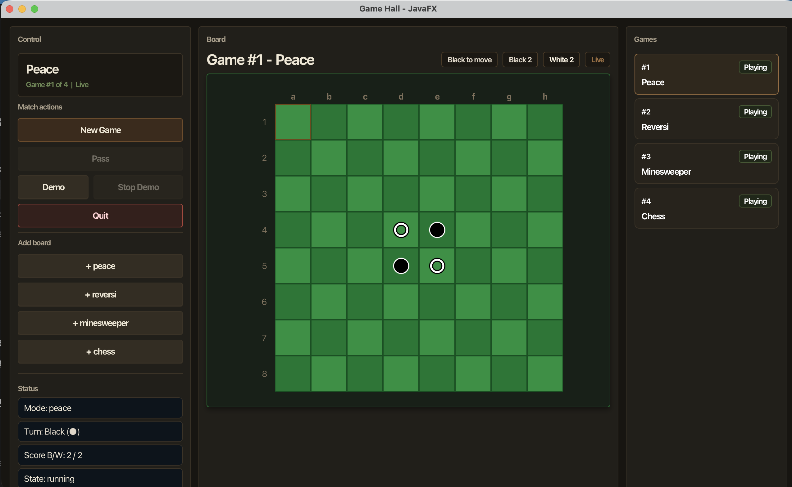
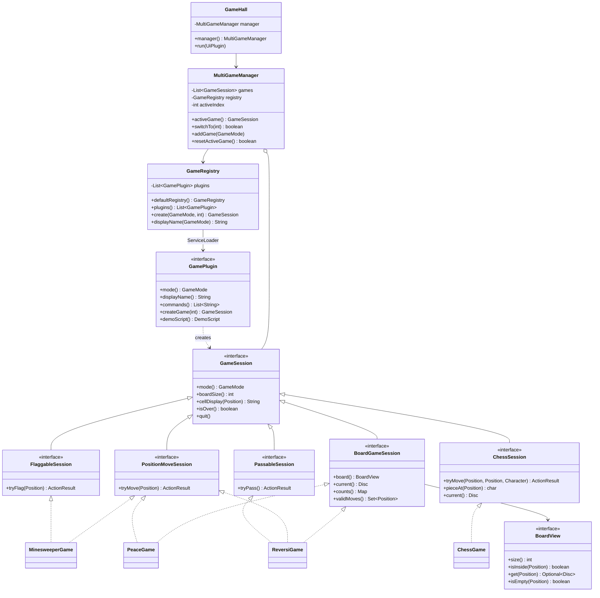
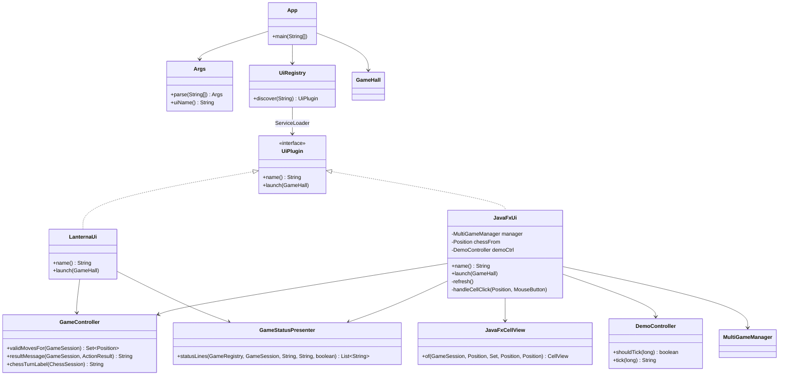

# Lab 6 实验报告：基于 JavaFX 的游戏大厅 GUI 实现

**学号**：25300270086  
**姓名**：胡家瑞  
**课程**：面向对象程序设计  
**日期**：2026 年 6 月 4 日

---

## 一、实验目标

本次 Lab6 的任务是在 Lab5 的游戏大厅基础上，用 JavaFX 实现一套新的图形用户界面。这里的“新界面”不只是把原来 TUI 的命令输入框搬进窗口，而是要按照 GUI 的方式重新组织交互：用户通过鼠标点击棋盘、按钮和右侧游戏列表完成操作。

结合实验要求，本次实现主要覆盖以下几点：

1. 保持 Lab5 中 Peace、Reversi、Minesweeper、Chess 的核心规则不退化；
2. 使用 JavaFX 实现左中右三栏布局；
3. 支持鼠标点击切换游戏、重置当前游戏、新增游戏和退出程序；
4. 游戏内操作采用更符合 GUI 习惯的交互方式，例如扫雷左键翻开、右键插旗，国际象棋先选中棋子再点击目标格；
5. 保留 Demo 模式，并修复 Stop Demo 无法及时响应的问题；
6. 在报告中分析 TUI 与 GUI 的架构差异，以及哪些代码被复用、哪些部分需要解耦。

国际象棋部分仍按照本课程 Lab5/Lab6 的要求处理：**吃掉王即胜**。这一点虽然不同于完整国际象棋规则中的将死判定，但它是本实验规则的一部分，所以我没有把它当作 bug 修改。

---

## 二、实验环境与运行方式

项目使用 Maven 管理，主要依赖包括 JavaFX 和 Lanterna。

运行 JavaFX GUI：

```bash
./mvnw javafx:run
```

运行测试：

```bash
./mvnw test
```

当前项目仍保留 TUI 和 GUI 两套入口。TUI 适合验证命令解析和终端交互，GUI 则作为 Lab6 的主要提交内容。

---

## 三、预估修改与实际修改对比

Lab6 要求说明预估修改和 AI 实际修改内容。我把这一部分单独列出来，一方面是为了对照任务完成情况，另一方面也是为了确认代码还在自己能理解和控制的范围内。

| 项目 | 预估修改 | 实际完成情况 |
| --- | --- | --- |
| GUI 主界面 | 在 JavaFX 中实现左中右布局 | 调整为左侧控制区、中间棋盘、右侧游戏列表、底部消息栏 |
| 游戏切换 | 点击右侧列表切换当前对局 | 切换后各局状态可以保留，不会重新初始化 |
| 新建游戏 | 点击按钮重置当前游戏 | 新增 `MultiGameManager.resetActiveGame()`，只替换当前槽位 |
| 游戏操作 | 鼠标点击棋盘代替命令输入 | 不同游戏按已有能力接口分发，没有重写规则 |
| 扫雷 | 左键翻开，右键插旗 | 加入右键插旗，也区分未翻开的空白与已翻开的空白 |
| 国际象棋 | 点击起点，再点击终点 | 加入选中状态和错误选择提示 |
| Demo | 保留自动演示 | 修掉 Stop Demo 频繁刷新导致不容易点中的问题 |
| UI 风格 | 初步从“命令行窗口”改成游戏 GUI | 后来又把棋盘和菜单的颜色区分开，减少霓虹感 |
| 架构整理 | 尽量复用核心逻辑 | 增加只读棋盘视图、状态展示器、棋盘格视图类 |
| 插件机制 | 继续保留 Lab5 的扩展能力 | 游戏插件和 UI 插件仍通过 Java SPI 接入 |

这次修改中，我比较注意的一点是没有把 JavaFX 写成另一套游戏。Peace、Reversi、Minesweeper 和 Chess 的规则类仍然是原来的核心，GUI 只是调用它们暴露的操作接口。这样做的好处是界面可以变化，但胜负判断、边界处理、Demo 脚本还是同一套逻辑，不会出现 TUI 和 GUI 玩出来结果不一致的情况。

---

## 四、相对 Lab5 的增量设计

### 4.1 从命令驱动到事件驱动

Lab5 的 TUI 主要是“输入命令字符串，然后解析命令”。例如：

```text
m 7e 5e
f 1a
switch 2
```

Lab6 的 GUI 不再要求用户记住这些命令。界面上的主要动作都转为 JavaFX 事件：

- 点击右侧游戏卡片：切换当前对局；
- 点击 `New Game`：重置当前对局；
- 点击 `Demo` / `Stop Demo`：启动或停止自动演示；
- 点击棋盘格：执行落子、翻开、选中棋子、移动棋子；
- 右键点击扫雷格子：插旗或取消旗帜。

我一开始也考虑过保留一个命令输入框作为“万能入口”，但这样很容易变成 Lab5 TUI 的窗口包装版，不太符合 Lab6 对 GUI 交互的要求。所以最后把命令框从主交互路径中拿掉，让棋盘和按钮承担真正的输入职责。

### 4.2 左中右布局

当前 JavaFX 主窗口分成四个信息区域：

| 区域 | 内容 | 作用 |
| --- | --- | --- |
| 左侧 Control | 当前对局、按钮、状态文本 | 放置操作入口和详细反馈 |
| 中间 Board | 棋盘和顶部摘要 | 作为主要游戏区域 |
| 右侧 Games | 多个对局列表 | 展示并切换游戏大厅中的所有对局 |
| 底部 Message | 最近一次操作反馈 | 给用户即时提示 |

这个布局的好处是比较直接：用户先看中间棋盘，再看右侧选择哪一局，左侧处理当前局动作。它不像早期版本那样把所有信息都堆在一个“终端式面板”里。

### 4.3 多对局管理

Lab5 已经有多对局大厅的概念。Lab6 中右侧游戏列表把这个能力可视化了。每个游戏项都显示编号、模式和状态，点击即可切换。

为了支持“只重置当前选中的游戏”，我在 `MultiGameManager` 中增加了：

```java
public boolean resetActiveGame() {
    if (games.isEmpty()) {
        return false;
    }
    GameMode mode = activeGame().mode();
    games.set(activeIndex, registry.create(mode, boardSize));
    return true;
}
```

它和 `addGame(mode)` 的语义不同：`addGame` 是增加一个新槽位，`resetActiveGame` 是替换当前槽位。这个区分在 GUI 里比较重要，因为用户点击 `New Game` 时通常期待“这一局重新开始”，而不是列表里多出一局。

### 4.4 Service Provider Interface 插件机制

我认为当前版本里一个比较值得保留的设计点是 Java 的 Service Provider Interface（SPI）机制。它不是这次为了 GUI 临时加上的，而是从 Lab5 的插件化思路延续下来。游戏大厅这种程序很适合这个结构：大厅负责组织和调度，具体有哪些游戏、有哪些 UI，则由插件提供。

当前项目中有两类 SPI：

| SPI 接口 | 配置文件 | 作用 |
| --- | --- | --- |
| `GamePlugin` | `META-INF/services/reversi.gamehall.GamePlugin` | 注册 Peace、Reversi、Minesweeper、Chess 等游戏 |
| `UiPlugin` | `META-INF/services/reversi.gamehall.UiPlugin` | 注册 Lanterna TUI 和 JavaFX GUI |

`GameRegistry` 会通过 `ServiceLoader.load(GamePlugin.class)` 发现游戏插件。这里还保留了一个 built-in fallback：如果资源文件没有被正确打包，程序仍然可以手动注册四个内置游戏。这个 fallback 比较朴素，但对课程作业来说很实用，至少不会因为 SPI 配置文件丢失就完全跑不起来。`UiRegistry` 则通过 `ServiceLoader.load(UiPlugin.class)` 发现 UI 插件，启动时根据参数选择 `lanterna` 或 `javafx`。

这个设计在 Lab6 中更明显地发挥了作用：JavaFX GUI 不是直接写进 `App`，而是作为一个新的 `UiPlugin` 接入。也就是说，新增 GUI 时没有拆掉原来的 TUI 入口，游戏大厅只是多了一个可选择的界面实现。

---

## 五、关键运行截图

本次初稿先保留一张新版 JavaFX UI 截图，作为当前界面状态记录。定稿前如果需要，再补扫雷插旗、国际象棋选中棋子、Demo 运行等操作截图。



从截图可以看到，当前界面已经不是早期的 TUI 外壳式设计。棋盘在中间，右侧列表可以直接切换四个初始对局，左侧按钮区提供 New Game、Pass、Demo、Stop Demo 和 Quit。棋盘颜色也做了区分：Peace / Reversi 使用绿色棋盘，Chess 使用传统木色棋盘，Minesweeper 使用灰色格子风格，避免所有游戏都套同一套“霓虹面板”。

---

## 六、TUI 与 GUI 的架构比较

### 6.1 渲染机制不同

TUI 使用 Lanterna，本质上是在终端字符网格上绘制内容。棋盘、状态、提示语都是字符串，刷新时通常重新绘制一批文本。它的优点是简单、稳定，适合命令式输入；缺点是表达能力有限，很难自然表示鼠标悬停、按钮禁用、右键操作等 GUI 行为。

JavaFX 使用场景图。按钮、标签、棋盘格、列表项都是节点，JavaFX 根据节点树负责布局和重绘。样式可以通过节点属性和 CSS-like 字符串控制，图形绘制也可以利用 JavaFX 图形管线。GUI 的状态不再只是几行文本，而是体现在按钮是否可点、棋盘格颜色、选中边框、Tooltip 和消息栏中。

### 6.2 UI 组织方式不同

本项目的 JavaFX 界面采用命令式 Java 代码创建节点，例如 `BorderPane`、`HBox`、`VBox`、`GridPane`、`Button`、`Label`。这样写的好处是和现有游戏大厅对象连接比较直接，尤其是当前界面会根据不同 `GameSession` 动态生成棋盘和按钮状态。

如果使用 FXML，可以把界面结构声明在 XML 中，再把事件绑定到 Controller。FXML 更适合界面结构稳定、需要和可视化设计工具协作的项目。本实验中棋盘大小、游戏类型、按钮状态、状态摘要都依赖运行时对象，命令式 JavaFX 更方便维护，也减少了 FXML 与 Java 控制器之间的跳转成本。

### 6.3 事件处理模型不同

TUI 的事件流大致是：

```text
键盘输入 -> CommandParser -> ParsedCommand -> GameController -> GameSession
```

GUI 的事件流大致是：

```text
鼠标/按钮事件 -> JavaFxUi 回调 -> GameController/能力接口 -> GameSession -> refresh()
```

也就是说，TUI 的核心是“解析命令”，GUI 的核心是“响应事件”。例如扫雷插旗在 TUI 中是 `f 1a`，在 GUI 中则是右键点击某个格子。两者调用的最终业务接口可以相同，但输入层完全不同。

---

## 七、代码复用与解耦策略

为了让结构更直观，我把当前架构拆成两张 UML 类图。第一张关注游戏大厅、插件和核心规则对象；第二张关注 UI 插件层，也就是 TUI 和 GUI 如何共用同一个游戏大厅。

### 7.1 核心游戏架构 UML



这张图体现的是核心层的关系。`GameHall` 不直接创建具体游戏，而是通过 `MultiGameManager` 和 `GameRegistry` 间接管理；具体游戏由 `GamePlugin` 创建。不同游戏能力用接口拆开，例如扫雷才需要 `FlaggableSession`，黑白棋才需要 `PassableSession`，国际象棋才需要 `ChessSession`。这样 GUI 在处理点击时可以按能力判断，而不是写大量“如果当前游戏名字是 minesweeper/chess”的特殊分支。

### 7.2 UI 插件架构 UML



第二张图说明 Lab6 的 JavaFX 并没有取代 TUI，而是和 `LanternaUi` 一样作为 `UiPlugin` 接入。`App` 只负责解析参数并通过 `UiRegistry` 找到界面插件，真正的界面逻辑留在各自 UI 类中。`GameStatusPresenter` 和 `GameController` 是我后来保留下来的共享层：它们不直接画控件，但能避免 TUI 和 GUI 在状态文本、合法步提示、结果消息上各写一套。

### 7.3 可以完全复用的部分

以下模块没有依赖 Lanterna 或 JavaFX，所以 TUI 和 GUI 都可以使用：

- `core/model`：`Board`、`BoardView`、`Disc`、`GameMode`、`Position`、`ActionResult`；
- 游戏规则：`PeaceGame`、`ReversiGame`、`MinesweeperGame`、`ChessGame`；
- 游戏能力接口：`PositionMoveSession`、`FlaggableSession`、`PassableSession`、`ChessSession`；
- 游戏大厅：`GameHall`、`GameRegistry`、`GamePlugin`、`MultiGameManager`；
- UI 插件：`UiPlugin`、`UiRegistry`，以及通过 SPI 接入的 `LanternaUi` 和 `JavaFxUi`；
- Demo 机制：`DemoController` 与各游戏的 `DemoScript`；
- 共享展示：`GameStatusPresenter`。

这些类的共同点是只关心“游戏是什么状态、能做什么动作、动作是否合法”，不关心这些动作来自键盘还是鼠标。这个边界保住以后，GUI 改动虽然多，但没有把规则层一起卷进去。

### 7.4 必须解耦的部分

输入输出层不能强行复用：

- TUI 的输入是字符串，GUI 的输入是事件；
- TUI 的棋盘是字符矩阵，GUI 的棋盘是 JavaFX 节点网格；
- TUI 的反馈是状态行，GUI 的反馈还包括颜色、按钮禁用、选中框和 Tooltip；
- TUI 中的国际象棋移动是一次性输入 `from to`，GUI 中则需要保存“当前已选中的棋子”；
- TUI 中扫雷插旗是命令，GUI 中扫雷插旗是右键事件。

因此我的处理方式是：复用业务层，重写 UI 层；共享能共享的展示文本，但不强行共享具体控件渲染。

### 7.5 封装边界调整

这次复查架构时，我发现原来有几个地方容易让 UI 层和业务层耦合过深，所以做了调整。

第一，`BoardGameSession.board()` 改为返回 `BoardView`。GUI 只需要读取棋盘，不应该拿到可变棋盘后绕开规则直接修改。`BoardView` 只暴露：

```java
int size();
boolean isInside(Position p);
Optional<Disc> get(Position p);
boolean isEmpty(Position p);
```

这样 UI 层只能观察棋盘，不能破坏棋盘。

第二，继续使用 SPI 维持插件边界。`GamePlugin` 负责把游戏模式、命令别名、显示名称和创建游戏对象的逻辑封装起来；`UiPlugin` 负责把不同界面的启动方式封装起来。`App` 不需要知道 JavaFX 或 Lanterna 的具体类名，只通过 `UiRegistry` 选择插件。这样 Lab6 增加 GUI 时，改动主要留在 UI 实现里，没有把游戏大厅入口改成一串硬编码分支。

第三，新增 `GameStatusPresenter`。之前 TUI 和 GUI 各自组织状态文本，容易出现一边改了另一边没改的情况。例如黑白方显示、比分、扫雷雷数和 Chess 回合信息，都应该有统一来源。现在状态文本由 Presenter 统一生成，后续如果改显示文案，也不用两边分别找。

第四，新增 `JavaFxCellView`。早期 `JavaFxUi` 同时负责布局、事件和每个棋盘格的显示，类的职责过重。拆出 `JavaFxCellView` 后，棋盘格的文字、颜色、边框、Tooltip 集中在一个类中，`JavaFxUi` 更专注于整体界面和事件分发。

第五，Chess 的王车易位逻辑整理为 `CastlePlan`。之前真实移动和合法性探测里有相近条件，读起来比较容易漏；合并以后，规则位置更集中。

---

## 八、几个具体问题的处理

### 8.1 黑白颜色显示

早期版本为了在终端里看得清楚，用黄/绿表示棋子。放到 GUI 后，这会让用户分不清“Black”和“White”究竟对应什么颜色。因此这次改成更直观的显示：

- 黑方显示为黑色棋子；
- 白方显示为白色棋子；
- 状态栏写成 `Black (●)`、`White (○)`；
- Chess 中也按黑白方显示棋子，并用描边保证在棋盘上可读。

### 8.2 扫雷空白格

扫雷中“还没翻开的格子”和“已经翻开的 0 格子”如果都显示为空白，用户会误以为没有变化。GUI 中改为：

- 未翻开的格子使用凸起灰色块；
- 已翻开的 0 格使用打开后的灰色块和 `·`；
- 旗帜和地雷使用更醒目的红色符号；
- 数字格按数字显示。

这样即使没有数字，用户也能看出这块区域已经被翻开。

### 8.3 Stop Demo 卡住

原来的 Demo 刷新频率过高，`Timeline` 每 50ms 都会触发刷新，导致按钮区域频繁重建，用户点击 `Stop Demo` 时容易出现响应不及时的问题。现在的处理方式是：时间线仍然检查时间，但只有 `DemoController.shouldTick(now)` 返回 true 时才推进 Demo 并刷新界面。这样 Stop Demo 按钮不会一直被重复重建，手动停止可以正常响应。

### 8.4 UI 风格调整

最初的 GUI 有比较强的“终端感”和“霓虹感”：颜色偏冷，文字大写较多，所有区域都像同一块电子面板。后来我把风格调整为更接近桌面棋类游戏：

- 菜单和面板使用深棕、灰褐、木色边框；
- 棋盘区域和外围控制区不再使用完全相同的颜色；
- Chess 使用传统浅木色 / 深木色棋盘；
- Peace 和 Reversi 保留绿色棋盘；
- Minesweeper 使用经典灰色格；
- `CONTROL / ARENA / GAME LIST` 这类强烈终端感标题改为 `Control / Board / Games`。

这部分不是核心算法，但会影响用户是否能快速理解界面。尤其是棋盘游戏，如果棋盘和外部面板都做成同一种发光风格，反而会削弱棋盘本身的可读性。

---

## 九、异常与边界处理

GUI 中对常见边界情况做了提示或禁用：

- Demo 运行时，手动点击棋盘会提示先停止 Demo；
- `Stop Demo` 只在 Demo 模式下可用；
- `Pass` 只在支持跳过的游戏中可用；
- Reversi 无合法步时会提示点击 `Pass`；
- 非扫雷游戏右键点击会提示右键只用于扫雷插旗；
- Chess 先点击空格会提示先选择棋子；
- Chess 点击对方棋子作为起点会提示选择当前方棋子；
- 切换游戏时会清除 Chess 当前选中状态，避免把上一局选择带到下一局；
- `New Game` 只重置当前对局，不影响其他对局；
- `Quit` 使用 `Platform.exit()` 正常退出。

这些处理不复杂，但它们能避免 GUI 中常见的“点了没反应，也不知道为什么”的问题。

---

## 十、测试与验证

目前项目测试通过：

```bash
./mvnw test
```

已有测试覆盖了：

- 棋盘基础行为；
- Peace / Reversi 基础规则；
- Minesweeper 首步安全和 Demo；
- Chess 移动、吃子、升变、王车易位、Demo；
- 插件注册；
- 多对局切换；
- 当前对局重置。

最近一次完整测试结果为 26 个测试全部通过。JavaFX 界面也已经能够正常启动，并生成了本报告中的初始界面截图。

---

## 十一、个人总结

这次 Lab6 最主要的体会是：GUI 不是 TUI 的“皮肤”。如果只是把命令输入框放进窗口，代码看起来改动少，但用户其实仍然在按 TUI 的方式玩游戏。真正改成 GUI 后，输入方式、反馈方式和状态展示都要重新考虑。

从 OOP 角度看，我这次最想保住的是边界。游戏规则类不应该知道按钮、鼠标右键或 JavaFX 节点；反过来，JavaFX 也不应该直接修改棋盘数组。通过 `GameSession` 能力接口、`BoardView`、`GameStatusPresenter` 和 `JavaFxCellView`，目前项目的分层比一开始清楚一些。

另外，SPI 插件机制在这次实验中也体现出了价值。游戏插件和 UI 插件都可以被 `ServiceLoader` 发现，Lab6 新增 JavaFX 时没有推翻 Lab5 的结构，而是作为新的 UI 实现接入。相比在 `main` 函数里写很多 `if/else` 去 new 不同界面，这种写法更像一个可以继续扩展的游戏大厅。

当然，现在的实现也不是完全理想。JavaFX 的样式字符串还比较多，`JavaFxUi` 仍然偏长；GUI 层也缺少真正的自动化点击测试。后面如果继续做，我会优先把样式抽出，并补更多 GUI 层验证。不过就本次 Lab6 的要求而言，当前版本已经完成了从 TUI 逻辑到 JavaFX 事件驱动界面的主要改造。
